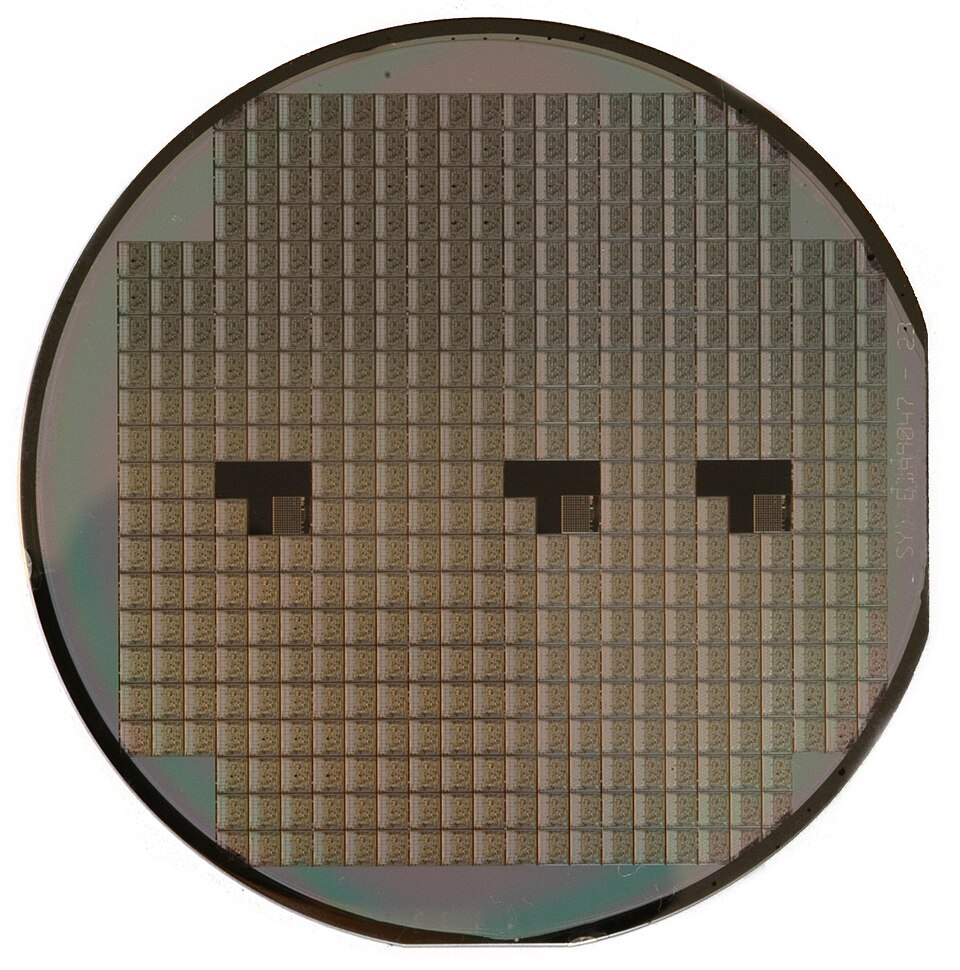
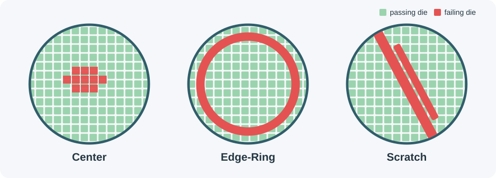

# Wafer Map Failure Pattern Classification

This repository contains the group project developed for the **Foundations of Deep Learning** university course at the University of Milano-Bicocca, academic year 2025/2026.

The project investigates how deep neural networks can classify spatial failure patterns in semiconductor wafer maps. Its purpose is not merely to predict a label: the analysis should help connect the geometry of failing dies to recurring manufacturing problems and support faster, more consistent quality control.

## From a silicon wafer to a wafer map

A **wafer** is a thin, circular slice of semiconductor material, usually silicon. During fabrication, many copies of an integrated circuit are produced simultaneously on its surface. Each rectangular circuit unit is called a **die**. After fabrication, every die is electrically tested; dies that pass can proceed to packaging, while failing dies are rejected.

*A real silicon wafer. Image by Inductiveload, released into the public domain via [Wikimedia Commons](https://commons.wikimedia.org/wiki/File:Silicon_wafer.jpg).*

A **wafer map** records the test result at each die position. It is therefore not an ordinary photograph: it is a structured, two-dimensional grid whose cells describe locations outside the wafer, passing dies, and failing dies. The spatial arrangement is essential. Two wafers may contain the same number of failures but exhibit very different patterns, suggesting different process faults.

*Original schematic created for this repository. Green cells represent passing dies and red cells represent failing dies.*

For example, a concentration of failures near the center, a ring along the boundary, or a diagonal scratch may originate from different equipment conditions or fabrication steps. Automatically recognizing these shapes can help engineers narrow down possible root causes, improve production yield, and reduce the time required for manual inspection.

## The problem

Given a wafer map, the project aims to train and evaluate a deep learning model that assigns it to one of the known failure-pattern categories in **MIR WM-811K**:

- `Center`
- `Donut`
- `Edge-Loc`
- `Edge-Ring`
- `Loc`
- `Near-Full`
- `Random`
- `Scratch`
- `None` (no recognized failure pattern)

This is a multiclass image-classification problem, but it presents several challenges beyond a conventional benchmark:

- wafer maps have varying spatial dimensions and die layouts;
- only part of the complete collection has expert-assigned labels;
- the labeled classes are highly imbalanced;
- the `None` class dominates, while some failure patterns are rare;
- resizing or padding must preserve meaningful spatial structures;
- accuracy alone can hide weak performance on minority failure classes.

The work will therefore include dataset exploration, a reproducible preprocessing pipeline, model development, controlled experiments, and both quantitative and qualitative error analysis. Evaluation should emphasize the confusion matrix, per-class precision, recall and F1-score, and macro-averaged F1 in addition to overall accuracy.

## Dataset

The project uses the **MIR WM-811K** dataset, a real-world collection of **811,457 wafer maps** from semiconductor fabrication. Approximately **172,950 maps have an assigned label**, while the remaining maps are unlabeled. The labeled portion contains the eight recognized defect patterns plus the `None` category and is strongly imbalanced.

- **Official download:** [MIR-WM811K.zip](http://mirlab.org/dataSet/public/MIR-WM811K.zip)
- **Input:** two-dimensional wafer maps
- **Task:** failure-pattern classification
- **Full collection:** 811,457 maps
- **Labeled subset:** approximately 172,950 maps

The dataset archive is intentionally not committed to Git. Downloaded data, generated artifacts, and trained weights should be stored locally in their designated directories and managed according to the repository's version-control policy.

## References

- M.-J. Wu, J.-S. R. Jang, and J.-L. Chen, *Wafer Map Failure Pattern Recognition and Similarity Ranking for Large-Scale Data Sets*, IEEE Transactions on Semiconductor Manufacturing, 2015.
- MIR Lab, [WM-811K public dataset](http://mirlab.org/dataSet/public/MIR-WM811K.zip).

