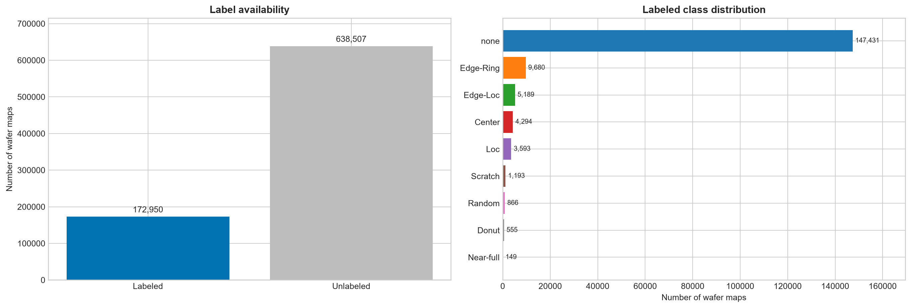
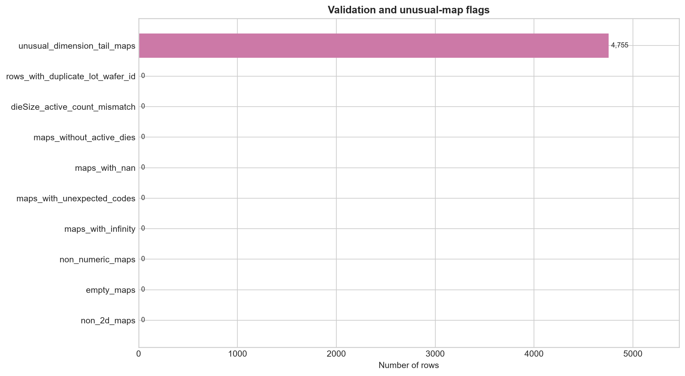
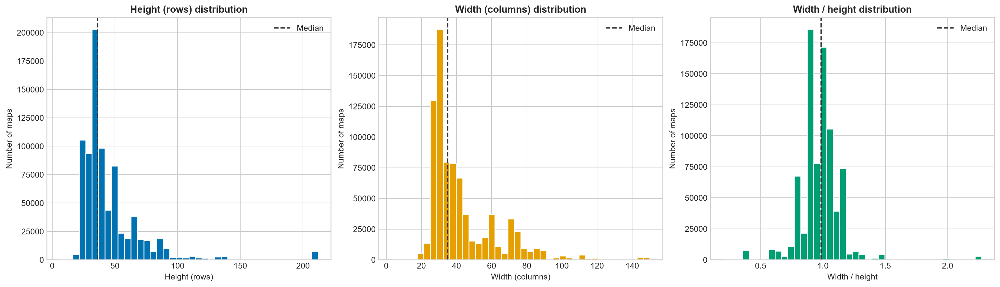
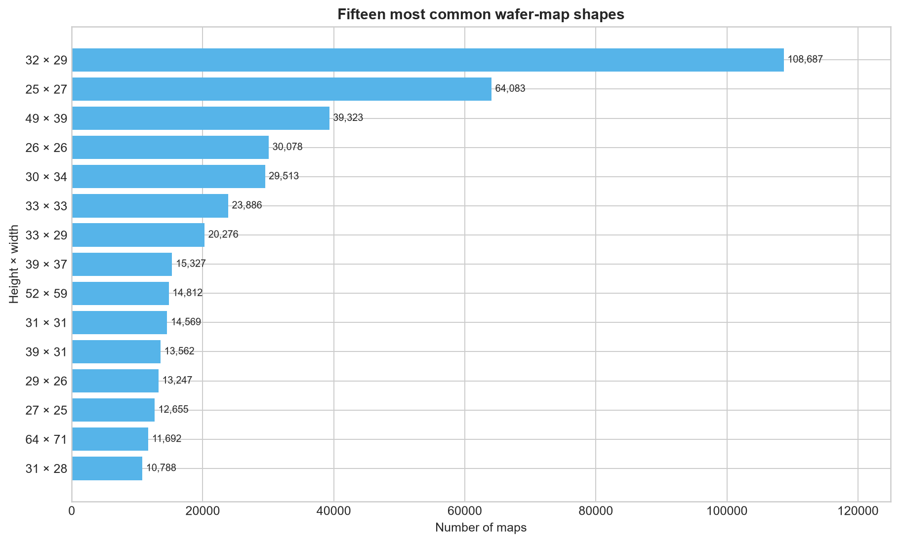
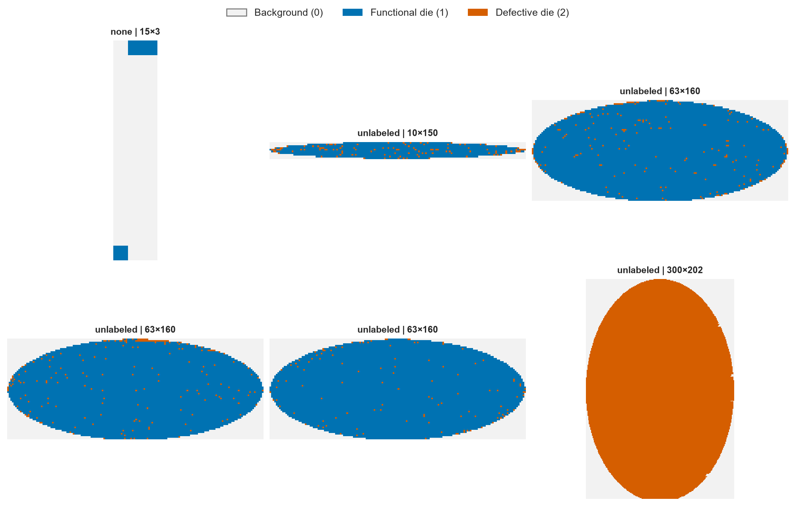
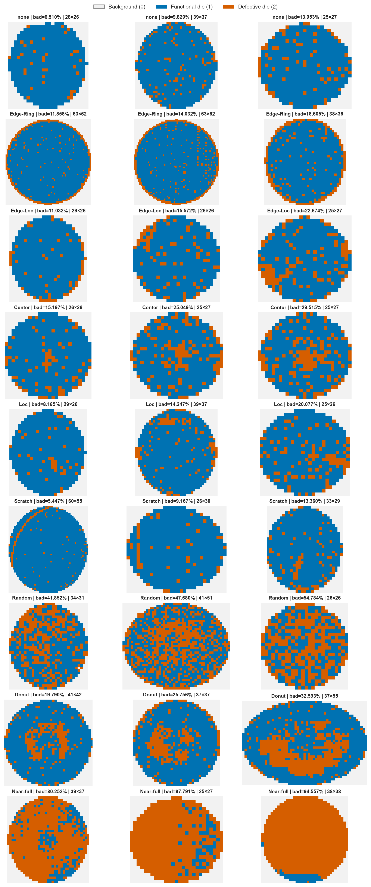
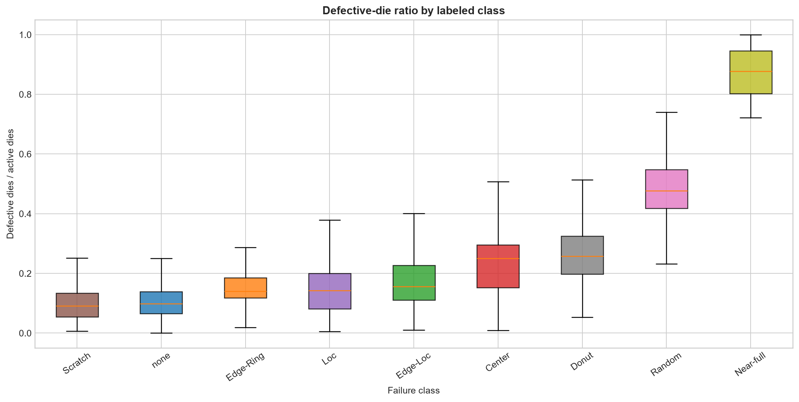
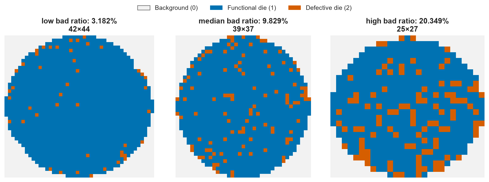
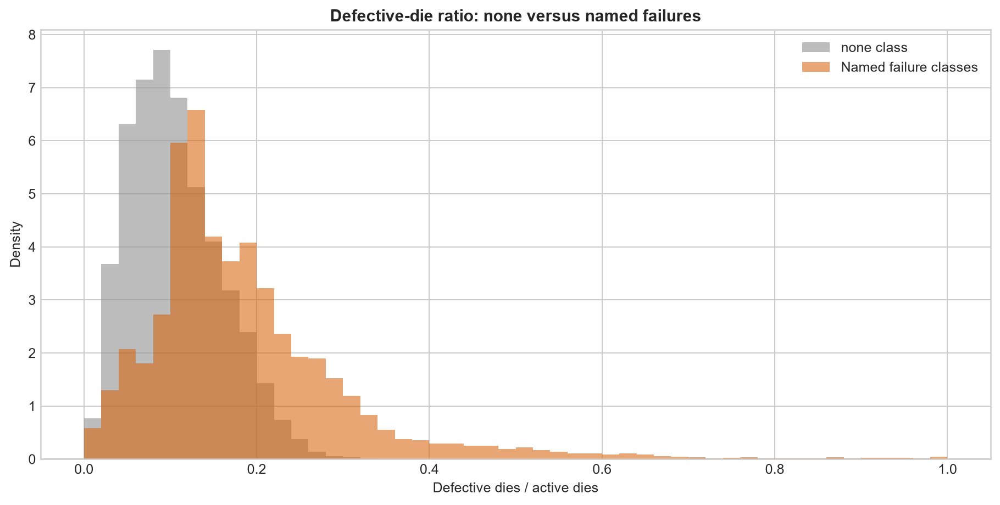

# WM-811K Exploratory Data Analysis Report

This report summarizes the executed analysis in [`notebooks/01_eda_wm811k_validation.ipynb`](../../notebooks/01_eda_wm811k_validation.ipynb). The notebook and its saved outputs are the source of truth for all values reported below.

## Dataset structure and label availability

The pickle contains a pandas DataFrame with **811,457 rows and 6 columns**: `dieSize`, `failureType`, `lotName`, `trainTestLabel`, `waferIndex`, and `waferMap`. Every wafer map is stored as a two-dimensional NumPy array rather than an external image file.

Only **172,950 maps (21.31%)** have a usable failure label; the remaining **638,507 maps (78.69%)** are unlabeled. In the original objects, these missing labels and split assignments are represented by numeric arrays containing zeros, so they required explicit normalization rather than an ordinary null-value check. Among labeled observations, 54,355 are marked `Training` and 118,595 are marked `Test`.

## Wafer-map encoding and structural validation

All 811,457 maps are two-dimensional `uint8` arrays. A complete scan found exactly three cell values:

| Code | Meaning | Cell count | Share of all cells |
|---:|---|---:|---:|
| 0 | Background / no die | 422,404,108 | 22.04% |
| 1 | Functional die | 1,393,453,681 | 72.72% |
| 2 | Defective die | 100,437,508 | 5.24% |

No map was non-numeric, non-2D, empty, without active dies, or affected by NaNs, infinities, or unexpected codes. The active-die counts derived from the arrays agreed with `dieSize` for every row, and no duplicate `(lotName, waferIndex)` identifiers were found.

The maps are therefore structurally consistent, but the three values are categorical states rather than natural-image intensities. Any transformation must preserve that distinction.

## Class distribution and imbalance

The supervised subset contains nine classes and is extremely imbalanced:

| Class | Count | Share of labeled maps |
|---|---:|---:|
| `none` | 147,431 | 85.24% |
| `Edge-Ring` | 9,680 | 5.60% |
| `Edge-Loc` | 5,189 | 3.00% |
| `Center` | 4,294 | 2.48% |
| `Loc` | 3,593 | 2.08% |
| `Scratch` | 1,193 | 0.69% |
| `Random` | 866 | 0.50% |
| `Donut` | 555 | 0.32% |
| `Near-full` | 149 | 0.09% |

The majority/minority ratio between `none` and `Near-full` is approximately **989.5:1**. Overall accuracy alone would therefore be dominated by the majority class and would not describe performance on rare defects.

## Wafer dimensions

The dataset contains **632 distinct `(height, width)` pairs**, so maps cannot be stacked directly into ordinary fixed-size batches. Heights range from **6 to 300** rows and widths from **3 to 205** columns. Median dimensions are **36 × 35**, while median area is 1,260 cells and median width-to-height ratio is 0.986. The most common shape is **32 × 29**, appearing 108,687 times (13.39%).

The analysis flagged **4,755 maps** in the outer 0.5% dimension tails. These are unusual but valid observations, not confirmed errors, and representative examples were retained for review.

## Spatial patterns and defect density

Three examples per class were selected deterministically near the 25th, 50th, and 75th percentiles of each class's defective-die ratio. The resulting comparison shows both recognizable spatial structures and substantial within-class variability.

Defective-die density differs meaningfully across classes but does not replace spatial information. Median defective-die ratios range from **9.17% for `Scratch`** and **9.83% for `none`** to **47.68% for `Random`** and **87.79% for `Near-full`**. Several classes overlap in density despite having different geometries, so aggregate die counts alone are insufficient for classification.

## The dominant `none` class

The `none` class contains **147,431 maps**, or **85.24% of the labeled subset**. It does not mean that a wafer has no defective dies: **147,430 `none` maps (99.9993%)** contain at least one defective die. Instead, the label indicates that no recognized spatial failure pattern was assigned.

The median defective-die ratio is **9.83%** for `none`, compared with **15.88%** across the named failure classes. The representative examples and distribution comparison also show that `none` is heterogeneous and partially overlaps other classes in defect density.

## Implications for preprocessing and modeling

The EDA supports the following conclusions and candidate responses:

- **Supervised subset:** a purely supervised baseline should use the 172,950 labeled maps and keep unlabeled maps separate unless a semi-supervised experiment is explicitly designed.
- **Variable dimensions:** a fixed-size representation is required for dense PyTorch batches. Padding and categorical-preserving resizing should be compared before selecting a strategy.
- **Discrete encoding:** interpolation must not create meaningless fractional states between background, functional, and defective dies. Single-channel and categorical-channel representations remain options to test.
- **Severe imbalance:** evaluation should include macro-F1, per-class precision/recall/F1, and a confusion matrix. Weighted losses, balanced sampling, or targeted augmentation are candidates for controlled experiments.
- **Dominant `none` class:** `none` must be analyzed separately during training and evaluation; it cannot be interpreted as a defect-free wafer.
- **Unusual dimensions:** tail observations should be reviewed before defining cleaning rules. Rarity alone is not evidence of corruption.

These are evidence-based implications, not final preprocessing or architecture decisions. The next stage should compare alternatives experimentally while preserving class semantics and spatial structure.
